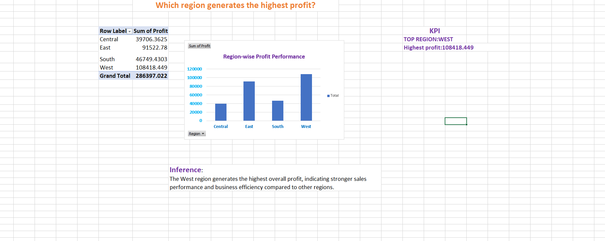
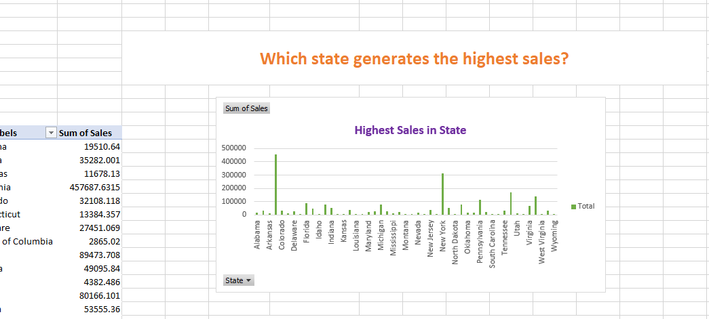
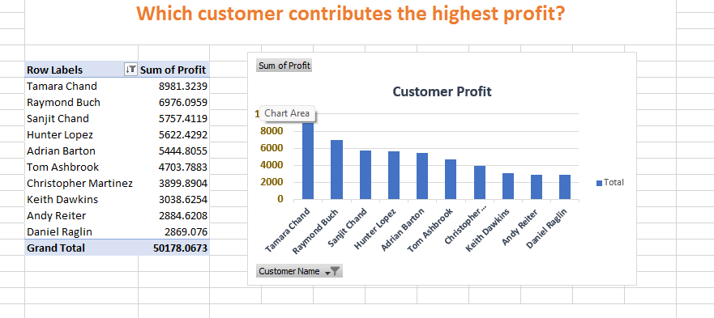

# Sales Superstore Business Analysis Dashboard

## Project Overview
This project analyzes retail sales and profit performance using a real-world Superstore dataset in Microsoft Excel. The project focuses on business intelligence, customer analysis, regional sales analysis, and profitability insights using Pivot Tables, Pivot Charts, KPIs, and VLOOKUP functions.

---

## Objectives
- Analyze regional and state-wise business performance
- Identify high-profit customers and product categories
- Generate data-driven business insights
- Perform customer profitability analysis
- Build interactive Excel-based analytics reports

---

## Tools & Technologies Used
- Microsoft Excel
- Pivot Tables
- Pivot Charts
- VLOOKUP
- KPI Reporting
- Drill-down Analysis
- Top 10 Filtering

---

## Business Questions Answered

### Q1: Which region generates the highest profit?
- West region generated the highest profit of 108,418.45.

---

### Q2: Which state generates the highest sales?
- California generated the highest sales of 457,687.63.

---

### Q3: Which customers contribute the highest profit?
- The dataset contained approximately 793 unique customers.
- To improve visualization clarity, Top 10 customers were filtered based on profit contribution.
- Top-performing customers contributed significantly to overall profitability.

---

## Key Insights
- The West region showed the strongest overall profitability.
- California demonstrated the highest sales contribution.
- A small group of high-value customers contributed significantly to profits.
- Pivot analysis improved visibility into business performance trends.

---

## Dataset Source
Kaggle Superstore Dataset

---

## Author
Srikavya R
